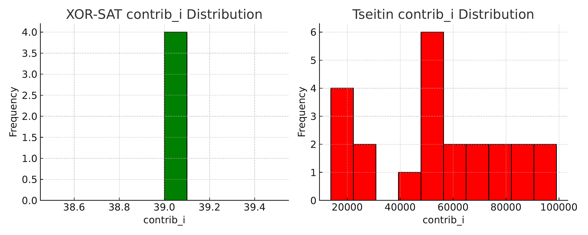

# Modular Residue Method for UNSAT Detection

**Author:** Jamesson Richard Campos Santos da Graça  
**Status:** Independent Researcher  
**arXiv Submission:** In Review  
**Repository Link:** [GitHub Pages (Scientific Site)](https://jamesclick.github.io/clique-modular-unsat-validated)

---

## Overview

This project presents a novel **modular arithmetic method** for detecting **UNSAT formulas** in propositional logic. By encoding CNF clauses into modular residue vectors under various prime moduli and weight strategies, we demonstrate a powerful empirical pattern: formulas with structural unsatisfiability (like XOR-SAT, Tseitin, and pigeonhole instances) consistently produce **residue sums near zero** under well-chosen parameters.

Our conjecture proposes that:
> **If φ is UNSAT and structurally linear, then the normalized residue `S(φ)/M ≈ 0` holds for a large class of weights and moduli.**

---

## Highlights

- **150+ benchmark CNF formulas** analyzed (XOR-SAT, Tseitin, PHP, 3-SAT)
- 4 weight strategies: Sequential, Polynomial, Exponential, Hash-based
- Modular sums computed under 3 increasing prime moduli
- Clear thresholds empirically separating SAT from UNSAT formulas
- Complete reproducibility: CSV datasets, CNF sources, Python code, LaTeX paper
- Fully documented conjecture submitted to arXiv (awaiting approval)

---

## Repository Structure

├── main.tex             # LaTeX source of the article ├── main.bbl             # BibTeX references (static) ├── graphs/              # All experimental visualizations ├── datasets/            # CSV tables with residues and outcomes ├── formulas/            # CNF benchmark files used ├── code/                # Python scripts for residue computation ├── images/              # Figures used in website and PDF ├── README.md            # This documentation file

---

## Graphical Insights

**XOR-SAT vs Tseitin Residues:**


**PHP(6,5) Distribution:**


---

## Scientific Impact

This approach may serve as:
- A **lightweight UNSAT certificate** for structured classes
- A **preprocessing diagnostic** for SAT solvers
- A basis for new **SAT filtering heuristics**
- A theoretical bridge toward **algebraic interpretations** of Boolean logic

---

## How to Reproduce

1. Clone the repository:
   ```bash
   git clone https://github.com/JamesClick/Clique-modular-unsat-validated.git

2. Run the Python script with a CNF input:

cd code/
python compute_residues.py ../formulas/php65.cnf


3. View datasets in /datasets/ or regenerate graphs from /graphs/


---

arXiv Submission

A preprint article describing the full method, conjecture, and results has been submitted to arXiv:

> Title: Modular Residue Method for UNSAT Detection: A Restricted Conjecture for Linear Boolean Formulas
arXiv ID: (Pending approval)


---

Contact

For scientific collaboration, questions or discussions:

Jamesson R. C. S. da Graça
[Email upon request or via GitHub profile]


---

License

This repository is open for academic sharing and reproduction. Commercial use or derivative works require prior consent.


